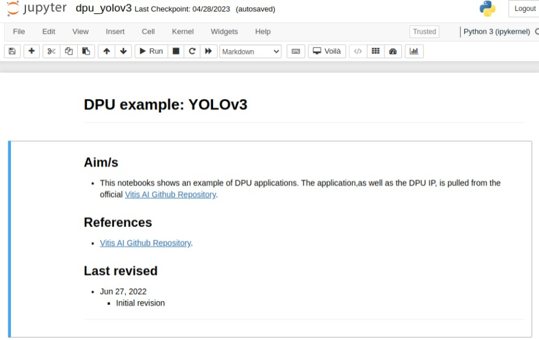

# Examine pre-trained YOLOv3 for DPU on PYNQ-ZU

## 1. Download YOLOv3 from model-zoo

After downloading and building vitis-ai docker image, user can run it and examine the modern workspace.

```
haipnh@Desktop:/mnt/workspace/Xilinx/Vitis-AI$ ./docker_run.sh xilinx/vitis-ai-gpu
WARNING: Please start 'docker_run.sh' from the Vitis-AI/ source directory
Setting up haipnh 's environment in the Docker container...
usermod: no changes
Running as vitis-ai-user with ID 0 and group 0 


==========================================
 
__      ___ _   _                   _____
\ \    / (_) | (_)            /\   |_   _|
 \ \  / / _| |_ _ ___ ______ /  \    | |
  \ \/ / | | __| / __|______/ /\ \   | |
   \  /  | | |_| \__ \     / ____ \ _| |_
    \/   |_|\__|_|___/    /_/    \_\_____|
 
==========================================

Docker Image Version: 2.5.0.1260   (GPU) 
Vitis AI Git Hash: afde2a1f5 
Build Date: 2023-04-19

For TensorFlow 1.15 Workflows do:
     conda activate vitis-ai-tensorflow 
For PyTorch Workflows do:
     conda activate vitis-ai-pytorch 
For TensorFlow 2.8 Workflows do:
     conda activate vitis-ai-tensorflow2 
For Darknet Optimizer Workflows do:
     conda activate vitis-ai-optimizer_darknet 
For PyTorch Optimizer Workflows do:
     conda activate vitis-ai-optimizer_pytorch 
For TensorFlow 1.15 Optimizer Workflows do:
     conda activate vitis-ai-optimizer_tensorflow 
For TensorFlow 2.8 Optimizer Workflows do:
     conda activate vitis-ai-optimizer_tensorflow2 
Vitis-AI /workspace > 
```

The current directory is mounted as `/workspace` in Vitis-AI docker image. 

[Follow this instruction to mount a dataset directory on hard drive to the environment in Vitis-AI docker image](#mount-a-dataset-directory-on-hard-drive-to-docker-image).

There are various deep learning frameworks to use, but it depends on the official supported models or user's purpose.

The target model in this tutorial is: [tf_yolov3_voc_416_416_65.63G_2.5](https://github.com/Xilinx/Vitis-AI/blob/2.5/model_zoo/model-list/tf_yolov3_voc_416_416_65.63G_2.5/model.yaml). At first glance, this model in implemented using `tensorflow` framework, named `yolov3`, input size is `416x416`, can perform `65.63 Gops per image` and supported on Vitis-AI version `2.5`.

For more details, read: [Model Details](https://github.com/Xilinx/Vitis-AI/tree/2.5/model_zoo#model-details) section of README file in Vitis-AI/model-zoo.

To download this model:
```
Vitis-AI /workspace > cd model_zoo/
Vitis-AI /workspace/model_zoo > python downloader.py 
Tip:
you need to input framework and model name, use space divide such as tf vgg16
tf:tensorflow1.x  tf2:tensorflow2.x  cf:caffe  dk:darknet  pt:pytorch  all: list all model
input:tf
```

User will be asked for the target framework, in this case, input `tf`.

A list of supported models for the chosen framework will be shown, then input `38`.
```
chose model
...
37 : tf_mobilenetv1_0.5_imagenet_160_160_150M_2.5
38 : tf_yolov3_voc_416_416_65.63G_2.5
39 : tf_rcan_DIV2K_360_640_0.98_86.95G_2.5
...
input num:38
```

A list of supported devices will be shown. Notice that option 1 is for examining on PC with GPU, and option 2 is for deploying on PYNQ-ZU board (an MPSoC platform).
```
chose model type
0: all
1 : GPU
2 : zcu102 & zcu104 & kv260
...
input num:1
tf_yolov3_voc_416_416_65.63G_2.5.zip
                                              100.0%|100%
done
```

Repeat above steps to download option 2.
```
input num:2
yolov3_voc_tf-zcu102_zcu104_kv260-r2.5.0.tar.gz
                                              100.0%|100%
done
```

It's better to extract them into the same directory.
```
mkdir tf_yolov3_voc_416_416_65.63G
mv tf_yolov3_voc_416_416_65.63G_2.5.zip yolov3_voc_tf-zcu102_zcu104_kv260-r2.5.0.tar.gz
cd tf_yolov3_voc_416_416_65.63G
unzip tf_yolov3_voc_416_416_65.63G_2.5.zip
tar xf yolov3_voc_tf-zcu102_zcu104_kv260-r2.5.0.tar.gz
```

## 2. Examine YOLOv3 on PC
After extracting, run `ls` command and there are directories as follows:
```
tf_yolov3_voc_416_416_65.63G_2.5      yolov3_voc_tf      yolov3_voc_tf-zcu102_zcu104_kv260-r2.5.0.tar.gz
tf_yolov3_voc_416_416_65.63G_2.5.zip  yolov3_voc_tf_acc
```

Explanation:
- `tf_yolov3_voc_416_416_65.63G_2.5/`: This is environment to develop, train, test, quantize and compile the deep learning model. This can be called `dev-env` for short.
- `yolov3_voc_tf*/`: These directories contains pre-trained and pre-compiled models that are ready to deploy on DPU-PYNQ. Their file extension is `.xmodel`.

### Examine `dev-env`
```
cd tf_yolov3_voc_416_416_65.63G_2.5/
```

User should read the `README` file in `tf_yolov3_voc_416_416_65.63G_2.5/`. In summary, these actions need to be done at the beginning:
```
conda activate vitis-ai-tensorflow
pip install -r requirements.txt
```

If it returns errors about missing dependencies, install them.

Then, user prepares the VOC dataset as guided in `tf_yolov3_voc_416_416_65.63G_2.5/README`.

Now, a test can be executed.
```
bash code/test/run_eval.sh
```

Examine the `code/test/run_eval.sh` script, notice that it executes `tf_prediction.py` with given parameters:
```
python code/test/tf_prediction.py \
    --input_graph ${WEIGHTS} \
    --eval_image_path ${IMG_DIR} \
    --eval_image_list ${TEST_LIST} \
    --result_file ${RESULT_FILE} \
    --gpus ${GPUS} \
```

The given parameters specify:
- The pre-trained weights will be loaded.
- Directory to the dataset.
- List of image files will be used to evaluate.
- Result file.

Now open `code/test/tf_prediction.py` file. Everything should start with a main() function:
```python
if __name__ == "__main__":

    config = Config()
    class_names = config.classes
    predictor = yolo_predictor(config)

    sess = tf.compat.v1.Session()
    with tf.io.gfile.GFile(FLAGS.input_graph, 'rb') as f: # file I/O
        graph_def = tf.compat.v1.GraphDef()
        graph_def.ParseFromString(f.read()) # get graph_def from file
        sess.graph.as_default()
        tf.import_graph_def(graph_def, name='')  # import graph
    sess.run(tf.compat.v1.global_variables_initializer())

    input_x = sess.graph.get_tensor_by_name(FLAGS.input_node + ':0')
    output_y = []
    for node in FLAGS.output_node.split(","):
        output_y.append(sess.graph.get_tensor_by_name(node + ":0"))

    input_image_shape = tf.compat.v1.placeholder(tf.int32, shape=(2))
    pred_boxes, pred_scores, pred_classes = predictor.predict(output_y, input_image_shape)

    with open(FLAGS.eval_image_list) as fr:
        lines = fr.readlines()
    fw = open(FLAGS.result_file, "w")
    for line in tqdm(lines):
        img_id = line.strip()
        img_path = os.path.join(FLAGS.eval_image_path, img_id + '.jpg')
        image = cv2.imread(img_path)
        image = image[...,::-1] # BGR -> RGB
        # items = get_detection(image, (config.height, config.width), class_names)
        items = get_detection(image, (FLAGS.input_height, FLAGS.input_width), class_names)
        write_items_to_file(img_id, items, fw)
    fw.close()
```

Notice these 2 functions are used and modified to work on DPU-PYNQ.
```python
def letterbox_image(image, size):
    '''resize image with unchanged aspect ratio using padding'''
    ih, iw, _ = image.shape
    w, h = size
    scale = min(w/iw, h/ih)
    nw = int(iw*scale)
    nh = int(ih*scale)

    image = cv2.resize(image, (nw,nh), interpolation=cv2.INTER_LINEAR)
    new_image = np.ones((h,w,3), np.uint8) * 128
    h_start = (h-nh)//2
    w_start = (w-nw)//2
    new_image[h_start:h_start+nh, w_start:w_start+nw, :] = image
    return new_image

# ...

def get_detection(image, model_image_size, class_names):
    image_h, image_w, _ = image.shape

    # image preprocessing
    if model_image_size != (None, None):
        assert model_image_size[0]%32 == 0, 'Multiples of 32 required'
        assert model_image_size[1]%32 == 0, 'Multiples of 32 required'
        boxed_image = letterbox_image(image, tuple(reversed(model_image_size)))
    else:
        new_image_size = (image_w - (image_w % 32), image_h - (image_h % 32))
        boxed_image = letterbox_image(image, new_image_size)
    image_data = np.array(boxed_image, dtype='float32')
    image_data /= 255.
    image_data = np.expand_dims(image_data, 0)  # Add batch dimension.

    out_boxes, out_scores, out_classes, out_y = sess.run(
        [pred_boxes, pred_scores, pred_classes, output_y],
        feed_dict={input_x: image_data, input_image_shape: (image_h, image_w)})

    # convert the result to label format
    items = []
    for i, c in reversed(list(enumerate(out_classes))):
        predicted_class = class_names[c]
        box = out_boxes[i]
        score = out_scores[i]

        top, left, bottom, right = box
        top = max(0, np.floor(top + 0.5).astype('int32'))
        left = max(0, np.floor(left + 0.5).astype('int32'))
        bottom = min(image_h, np.floor(bottom + 0.5).astype('int32'))
        right = min(image_w, np.floor(right + 0.5).astype('int32'))
        item  = [predicted_class, score, left, top, right, bottom]
        items.append(item)

    return items
```

## 3. Deploy YOLOv3 on DPU-PYNQ
Deploy a model on DPU-PYNQ is a challenging task, although it uses Jupyter and IPython for writing Python code with ease.

This section explains how to make it working.

On PYNQ-ZU, after [installing DPU-PYNQ](README.md#2-dpu-pynq---tools-on-pynq-zu), open [pynq-dpu/dpu_yolov3.ipynb](notebooks/pynq-dpu/dpu_yolov3.ipynb).


Here is the main flow of this example notebook:
1. Import `pynq_dpu` Python wrapper library for DPU, then load `dpu.bit` bitstream file onto FPGA resources.
2. Import ultility libraries: `os, time, numpy, cv2, random, colorsys, matplotlib`.
3. Load model `tf_yolov3_voc.xmodel` onto DPU.
4. Define constants.
5. Define ultility functions.
6. Initialize VART (Vitis AI RunTime), and pre-allocate buffers for DPU.
7. Define `run()` function to invoke DPU.
- 7.1. Read input image.
- 7.2. Pre-processing.
- 7.3. Fetch data to DPU and trigger it.
- 7.4. Retrieve output data
- 7.5. Decode outputs, using ultility functions defined in 5.
- 7.6. Conditionally display the output.
8. Call `run()` with one input, and display output image.
9. Measure performance.
10. Remove VART references and clean up FPGA resources.

When examine the code in `dpu_yolov3.ipynb`, user will notice that most functions are relating to functions in `tf_prediction.py`.

After finish examining `dpu_yolov3.ipynb`, remember to `File -> Close and Halt` to safely close the notebook.

## Mount a dataset directory on hard drive to docker image
Assume there is a directory storing dataset at `/mnt/hard-drive/dataset` on hard drive, it can be mounted to the environment as follows.

1. Open `Vitis-AI/docker_run.sh` file to edit.

2. Find this section:
```
docker_run_params=$(cat <<-END
    -v /dev/shm:/dev/shm \
    -v /opt/xilinx/dsa:/opt/xilinx/dsa \
    -v /opt/xilinx/overlaybins:/opt/xilinx/overlaybins \
    -e USER=$user -e UID=$uid -e GID=$gid \
    -e VERSION=$VERSION \
    -v $DOCKER_RUN_DIR:/vitis_ai_home \
    -v $HERE:/workspace \
    -w /workspace \
    --rm \
    --network=host \
    ${DETACHED} \
    ${RUN_MODE} \
    $IMAGE_NAME \
    $DEFAULT_COMMAND
END
)
```
Add another `-v` parameter before `-w /workspace \`: 
```
...
    -v $HERE:/workspace \
    -v /mnt/hard-drive/dataset/:/workspace/dataset \
    -w /workspace \
    --rm \
...
```

3. When user examines a target model, create a symbolic link to the dataset:
```
cd model_zoo/tf_yolov3_voc_416_416_65.63G/tf_yolov3_voc_416_416_65.63G_2.5/data
ln -s /workspace/dataset/voc
```
