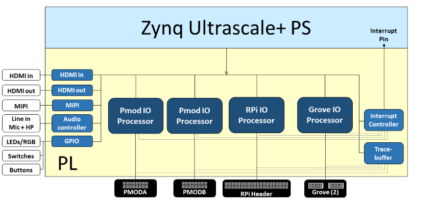

# PYNQ-ZU_Tutorial

This repository (repo.) provides you the materials to getting started with FPGA application development using PYNQ-ZU board - an AMD (Xilinx before) Zynq Ultrascale+ development board.

## PYNQ-ZU Block Diagram

## Terms
- FPGA: Field Programmable Gate Arrays
- MPSoC: Short of Xilinx® Zynq® UltraScale+™ MultiProcessor System on a Chip (MPSoC)
- PS: Processing System, indicates Arm Cortex-A53 Based Application Processing Unit (APU), and Dual-core Arm Cortex-R5F Based Real-Time Processing Unit (RPU) on MPSoC.
- PL: Programmable Logic, means FPGA resources in an MPSoC device.
- Soft-core: A sub processor in an heterogeneous system. These processors are usually synthesized and implemented on an FPGA.
- MicroBlaze: A soft-microprocessor which is built as a sub-system for I/O control in MPSoC platforms.
- Vitis Libraries: A library contains an extensive set of open-source, performance-optimized libraries that offer out-of-the-box acceleration with minimal to zero-code changes to your existing applications.
- DPU: Short of Deep Learning Processor Unit - A special soft-core which is designed, synthesized and implemented on AMD FPGAs to accelerate deep learning models.
- Vitis AI: A comprehensive AI inference development solution for AMD devices, boards, and Alveo™ data center acceleration cards. It consists of a rich set of AI models, optimized deep learning processor unit (DPU) cores, tools, libraries, and example designs for AI at the edge and in the data center.
- ROS: Robot Operating System is an open-source robotics middleware suite. It contains a set of software libraries and tools that help you build robot applications.

## How to use this repo.
- [1_OpenCV-PS](1_OpenCV-PS): Examine software-based application using ARM processors inside the MPSoC.
- [2_OpenCV-PL](2_OpenCV-PL): Examine accelerated application using FPGA resources inside the MPSoC.
- [3_PMOD](3_PMOD): Examine I/O control via PMOD interfaces with Microblaze Subsystems.
- [4_ROS](4_ROS): How to install ROS and exploit the ROS-based application development.
- [5_AI-Models-Zoo](5_AI-Models-Zoo): Develop application using pre-trained deep learning models from Vitis AI model zoo.
- [9_Auxiliary](9_Auxiliary): Several code snippets to use PYNQ-ZU with ease.

## PYNQ-ZU Toolchain Version Compatibility Matrix

| PYNQ | Vivado/Vitis | Vitis-AI | DPU-PYNQ |    ROS   |
|:----:|:------------:|:--------:|:--------:|:--------:|
| 2.7 (Austin)  | <= 2020.2    | 1.4      | 1.4      | :heavy_check_mark: noetic |
| 3.0 (Belfast) | <= 2022.1    | 2.5      | 2.5      | :x: humble |

**Note**
- After installing Vitis_HLS/Vivado/Vitis, follow this [instruction to patch an Y2K22 fix](https://support.xilinx.com/s/article/76960?language=en_US).
- Installing ROS2 `humble` on PYNQ 3.0 (Belfast) is facing unresolved issue: APT's unmet dependencies.

## Reference
[1] [PYNQ-ZU Documentation](https://xilinx.github.io/PYNQ-ZU/)

[2] [PYNQ-ZU distributed by E-Elements](https://www.e-elements.com.tw/products/fpga_system/xup_pynq/pynq-zu/)

[3] [PYNQ-ZU designed by TUL Embedded](https://www.tulembedded.com/FPGA/ProductsPYNQ-ZU.html)

[4] [Zynq UltraScale+ MPSoC](https://www.xilinx.com/products/silicon-devices/soc/zynq-ultrascale-mpsoc.html)

[5] [Vitis™ Accelerated Libraries](https://www.xilinx.com/products/design-tools/vitis/vitis-libraries.html)

[6] [Vitis™ Libraries Github repo.](https://github.com/Xilinx/Vitis_Libraries)

[7] [PYNQ documentation](https://pynq.readthedocs.io/en/v2.7.0/)

[8] [PYNQ Frequently Asked Questions (FAQs)](https://pynq.readthedocs.io/en/v2.7.0/faqs.html)

[9] [PYNQ embedded community projects](http://www.pynq.io/community.html)

[10] [PYNQ forum](https://discuss.pynq.io/)

[11] [DPU for Convolutional Neural Network](https://www.xilinx.com/products/intellectual-property/dpu.html)

[12] [DPU on PYNQ](https://github.com/Xilinx/DPU-PYNQ)

[13] [Vitis™ AI](https://www.xilinx.com/products/design-tools/vitis/vitis-ai.html)

[14] [Vitis™ AI Github repo.](https://github.com/Xilinx/Vitis-AI)

[15] [Xilinx Wiki](https://xilinx-wiki.atlassian.net/wiki/spaces/A/overview)

[16] [ROS - Robot Operating System](https://www.ros.org/)
